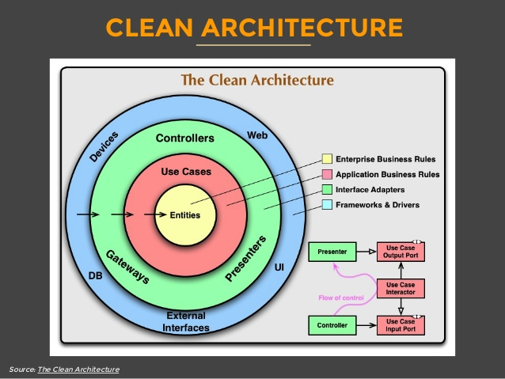
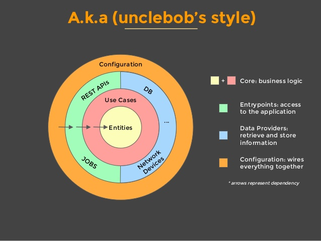

# clean-architecture-springboot

Applied clean architecture in springboot

It was based in [this presentation](http://www.slideshare.net/mattiabattiston/real-life-clean-architecture-61242830).

The full example is present in [microservices-tutorial](https://github.com/trevezani/microservices-tutorial)

***

## Application Structure





***

## Building and Running the springboot application

* building:
```
mvn clean package
```
* running (from the jar, after having built it):
```
java -jar api-zipcode-infraestructure/target/api-zipcode.jar
```

Once running, you can call:
```
curl http://localhost:8080/zipcode/37188
```

